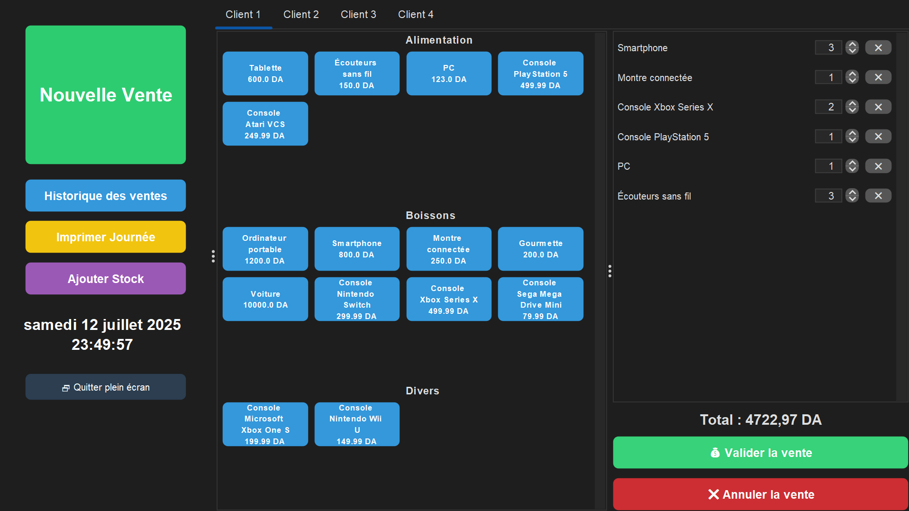

> ⚠️ Ce logiciel est encore en développement actif. Certaines fonctionnalités sont encore en cours de finalisation.
---

# Boutika

**Boutika** est une application de gestion de point de vente locale, moderne et légère, développée en Java Swing. Elle combine une interface fluide (FlatLaf), une base de données SQLite sécurisée (via SQLCipher), et une architecture propre (DAO/DTO) compatible avec Java 17+.

---

## ✨ Fonctionnalités principales

- ✅ Interface utilisateur moderne, belle et intuitive
- ✅ Multi-paniers : gestion de plusieurs clients en parallèle
- ✅ Historique complet des transactions
- ✅ Exportation des recettes journalières (PDF, CSV, etc.)
- ✅ Cross-platofme : fonctionne sur Windows, Mac ou Linux
- ✅ Chiffrement de la de base données avec SQLCipher
- ✅ Enregistrement rapide des ventes dans une base donnée SQLite
- ✅ Chiffrement la de base données avec SQLCipher
---

## 📦 Technologies utilisées

| Composant      | Détails                                 |
|----------------|------------------------------------------|
| Java           | 17+                                      |
| Swing          | Interface graphique                      |
| FlatLaf        | Stylisation moderne                      |
| SQLite         | Base de données locale                   |
| SQLCipher      | Chiffrement de la base de données        |
| Maven          | Gestion de projet et dépendances         |

---
